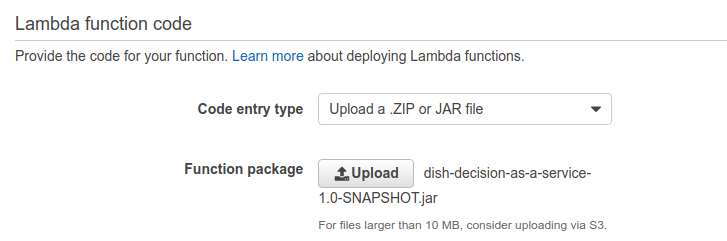
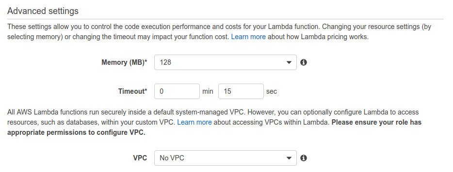
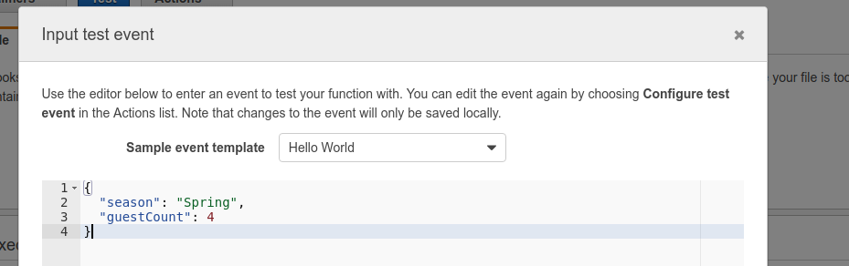
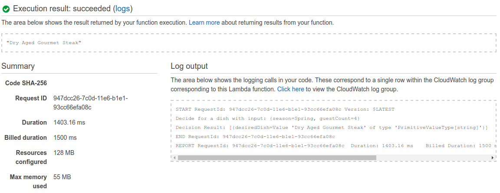
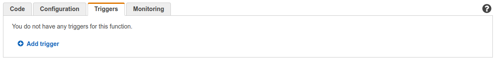
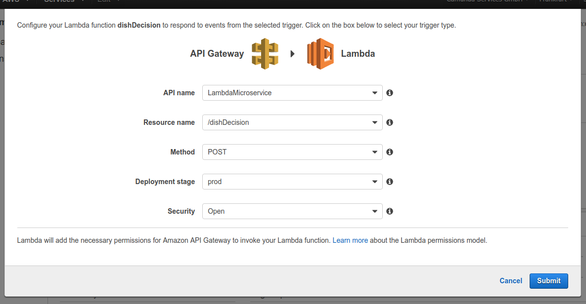
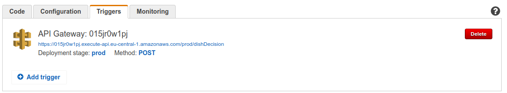

# Dish Decision with Camunda DMN Engine and AWS Lambda

This example demonstrates how to deploy a [DMN Decision][] as [AWS Lambda][]
function using the [Camunda DMN Engine][].

The Goal is to implement the following decision table to decide on a dish.


The decision expects two inputs. The current season and the number of guests we expect.
The output of the decision is the dish it recommends.

## Setup the Maven Project

First we need to create a new maven project. It requires the AWS Lambda API and the Camunda DMN Engine.

```xml
<dependency>
  <groupId>com.amazonaws</groupId>
  <artifactId>aws-lambda-java-core</artifactId>
  <version>1.1.0</version>
</dependency>
```

```xml
<dependency>
  <groupId>org.camunda.bpm.dmn</groupId>
  <artifactId>camunda-engine-dmn</artifactId>
  <version>7.5.0</version>
</dependency>
```

To deploy our java code to AWS Lambda we need a Java jar file with all dependencies shaded into it.

```xml
<build>
  <plugins>
    <plugin>
      <groupId>org.apache.maven.plugins</groupId>
      <artifactId>maven-shade-plugin</artifactId>
      <version>2.3</version>
      <configuration>
        <createDependencyReducedPom>false</createDependencyReducedPom>
      </configuration>
      <executions>
        <execution>
          <phase>package</phase>
          <goals>
            <goal>shade</goal>
          </goals>
        </execution>
      </executions>
    </plugin>
  </plugins>
</build>
```

For the complete configuration see the [pom.xml] in this repository.

## Create the Java Code for the Lambda Function

We need to create the Java code to execute the decision as AWS Lambda function. The Lambda
function receives a map of objects which represent our input variables for the
decision. The return value is the dish which is recommend.

Therefor we need to implement the RequestHandler Interface of the AWS Lambda API.

```java
/**
 *
 * Lambda request handlers implement AWS Lambda Function application logic using plain old java objects
 * as input and output.
 *
 * @param <I> The input parameter type
 * @param <O> The output parameter type
 */
public interface RequestHandler<I, O>  { ... }
```

Our code will receive a `Map<String, Object>` as input and returns a `String`.
The code will create a DMN Engine, parses our decision table ([dish.dmn][]) and
executes it with the input variables. Then returns the first entry of the
decision result as recommend dish.

```java
package org.camunda.bpm.example;

import java.io.InputStream;
import java.util.Map;

import com.amazonaws.services.lambda.runtime.Context;
import com.amazonaws.services.lambda.runtime.RequestHandler;
import org.camunda.bpm.dmn.engine.DmnDecisionTableResult;
import org.camunda.bpm.dmn.engine.DmnEngine;
import org.camunda.bpm.dmn.engine.impl.DefaultDmnEngineConfiguration;

public class DishDecisionAsAService implements RequestHandler<Map<String, Object>, String> {

  @Override
  public String handleRequest(Map<String, Object> input, Context context) {
    context.getLogger().log("Decide for a dish with input: " + input + "\n");

    DmnEngine dmnEngine = new DefaultDmnEngineConfiguration().buildEngine();

    InputStream decision = DishDecisionAsAService.class.getResourceAsStream("/dish.dmn");

    DmnDecisionTableResult results = dmnEngine.evaluateDecisionTable("dish", decision, input);

    context.getLogger().log("Decision Result: " + results + "\n");

    return results.getSingleResult().getSingleEntry();
  }

  }
```

To create the complete jar file to upload just run `mvn clean package` in
your project.

## Deploy the code to AWS Lambda

Login to your AWS account and go to the AWS Lambda service. Create
a new Lambda function and skip the blueprint selection. Also for now
skip the trigger configuration, we will do this later.

First we configure the name and the runtime of our Lambda function.


Then we upload our jar which we created with `mvn clean package`.



Then we define the handler of our Lambda function which is the full qualified name of
our Java Class.


Lastly we choose the lowest memory setting as the decision execution does not
need that much memory.



## Test your AWS Lambda function

After we deployed our Lambda function we can test that everything works
as expected. For example we want to test that for the following input
the result is `Dry Aged Gourmet Steak`:

```json
{
  "season": "Spring",
  "guestCount": 4
}
```

On the management page of your Lambda function you can define a test
environment and execute it.



The result verifies that our decision works correctly.




## Expose your AWS Lambda function as API Endpoint

The last step is to expose your Lambda function as an API endpoint so you
can use it from other microservices.

On the Lambda function management page you can add triggers which invoke your function in the triggers tab.



We define an API Gateway endpoint which expects a `POST` request and
is publicly available.



This creates a HTTP endpoint we can use to evaluate our dish decision.



To test it use your favorite REST client and evaluate some decisions.

```
POST /prod/dishDecision HTTP/1.1
Accept: application/json
Accept-Encoding: gzip, deflate
Connection: keep-alive
Content-Length: 38
Content-Type: application/json
Host: 015jr0w1pj.execute-api.eu-central-1.amazonaws.com
User-Agent: HTTPie/0.9.2

{
    "guestCount": 3,
    "season": "Spring"
}

HTTP/1.1 200 OK
Connection: keep-alive
Content-Length: 24
Content-Type: application/json
Date: Fri, 16 Sep 2016 13:11:22 GMT
Via: 1.1 75e45bac1c113bb2387b07927d8c593b.cloudfront.net (CloudFront)
X-Amz-Cf-Id: w6YDMvrsOeWsKn_IabS4-MlIJ5j_x-rTIKUGTZ2tUpa0epNS8O9X5Q==
X-Cache: Miss from cloudfront
x-amzn-RequestId: 0f53c360-7c0f-11e6-935e-1bceeaebc031

"Dry Aged Gourmet Steak"

```

```
POST /prod/dishDecision HTTP/1.1
Accept: application/json
Accept-Encoding: gzip, deflate
Connection: keep-alive
Content-Length: 37
Content-Type: application/json
Host: 015jr0w1pj.execute-api.eu-central-1.amazonaws.com
User-Agent: HTTPie/0.9.2

{
    "guestCount": 15,
    "season": "Fall"
}

HTTP/1.1 200 OK
Connection: keep-alive
Content-Length: 6
Content-Type: application/json
Date: Fri, 16 Sep 2016 13:10:40 GMT
Via: 1.1 20497c05bf77243afb14729ba45880ed.cloudfront.net (CloudFront)
X-Amz-Cf-Id: D0BAvdtCLUW9uvu-VHPfaPSlmZmFsWpGd_HY6DvUq4kQ8zhywssHqg==
X-Cache: Miss from cloudfront
x-amzn-RequestId: f6a762a0-7c0e-11e6-8ec3-45d2ca36f75e

"Stew"
```


[DMN Decision]: https://camunda.org/dmn/tutorial/
[AWS Lambda]: https://aws.amazon.com/en/lambda/details/
[Camunda DMN Engine]: https://docs.camunda.org/manual/latest/user-guide/dmn-engine/
[pom.xml]: pom.xml
[dish.dmn]: src/main/resources/dish.dmn
